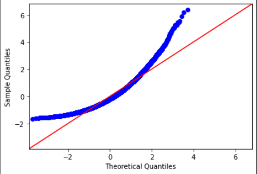

# Ex-06-Feature-Transformation

Date - 

Colab Link -https://colab.research.google.com/drive/11iA9R_FTAmWY-mVMs0D_1HQVQsaDvmX3?usp=sharing

Github Link -https://github.com/KATHIR1611/Ex-06-Feature-Transformation

# AIM
   To read the given data and perform Feature Transformation process and save the data to a file.
   
# Algorithm
   Step 1:Read the given Data.
   
   Step 2:Clean the Data Set using Data Cleaning Process.
   
   Step 3:Apply Feature Transformation techniques to all the features of the data set.
   
   Step 4:Save the data to the file.
   
# Code
 
 Developed by:Kathirvelan.K
 
 Register Number:212221220026
 
 ```
 import numpy as np
import pandas as pd
import matplotlib.pyplot as plt
import statsmodels.api as sm
import scipy.stats as stats

df = pd.read_csv("/content/Data_to_Transform.csv")
df

df.head()

df.isnull().sum()

df.info()

df.describe()

df1 = df.copy()

sm.qqplot(df['Highly Positive Skew'],fit=True,line='45')
plt.show()

sm.qqplot(df['Highly Negative Skew'],fit=True,line='45')
plt.show()

sm.qqplot(df['Moderate Positive Skew'],fit=True,line='45')
plt.show()

sm.qqplot(df['Moderate Negative Skew'],fit=True,line='45')
plt.show()

df['Highly Positive Skew'] = np.log(df['Highly Positive Skew'])

sm.qqplot(df['Highly Positive Skew'],fit=True,line='45')
plt.show()

df['Moderate Positive Skew'] = np.log(df['Moderate Positive Skew'])

sm.qqplot(df['Moderate Positive Skew'],fit=True,line='45')
plt.show()

df['Highly Positive Skew'] = 1/df['Highly Positive Skew']

sm.qqplot(df['Highly Positive Skew'],fit=True,line='45')
plt.show()

df['Highly Positive Skew'] = df['Highly Positive Skew']**(1/1.2)

sm.qqplot(df['Highly Positive Skew'],fit=True,line='45')
plt.show()

df['Moderate Positive Skew_1'], parameters=stats.yeojohnson(df['Moderate Positive Skew'])

sm.qqplot(df['Moderate Positive Skew_1'],fit=True,line='45')
plt.show()

from sklearn.preprocessing import PowerTransformer
transformer=PowerTransformer("yeo-johnson")
df['ModerateNegativeSkew_2']=pd.DataFrame(transformer.fit_transform(df[['Moderate Negative Skew']]))
sm.qqplot(df['ModerateNegativeSkew_2'],fit=True,line='45')
plt.show()

from sklearn.preprocessing import QuantileTransformer
qt = QuantileTransformer(output_distribution = 'normal')
df['ModerateNegativeSkew_2'] = pd.DataFrame(qt.fit_transform(df[['Moderate Negative Skew']]))
sm.qqplot(df['ModerateNegativeSkew_2'],fit=True,line='45')
plt.show()
```
# Output

Dataset


Head


Null data


Information


Description


Highly Positive Skew



Highly Negative Skew


Moderate Positive Skew


Moderate Negative Skew


Log of Highly Positive Skew


Log of Moderate Positive Skew


Reciprocal of Highly Positive Skew


Square root tranformation


Power transformation of Moderate Positive Skew


Power transformation of Moderate Negative Skew


Quantile transformation


# Result

   Thus, Feature transformation is performed and executed successfully for the given dataset.


 
